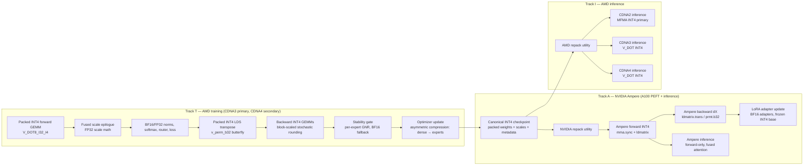

# Native INT4 Training on CDNA3 (with Ampere PEFT) and Portable INT4 Inference across CDNA2 / Ampere / CDNA3 / CDNA4

*Revision 5 — NVIDIA Ampere (A100) added as a secondary target: PEFT/adapter training and full inference. Independent codebase from the AMD stack, shared canonical checkpoint format and design principles. CDNA3 remains primary.*

## Executive summary

This project has two connected components spanning two GPU vendors: an INT4 GEMM-centered training stack for Kimi K2.5 primarily targeting AMD CDNA3 (with CDNA4 as a secondary training target and NVIDIA Ampere A100 as a secondary PEFT/adapter-training target), and a portable INT4 inference stack spanning CDNA2, NVIDIA Ampere, CDNA3, and CDNA4. The training and inference stacks are separate bodies of kernel code serving different constraints. The AMD and NVIDIA codebases are independent — they share design principles and the canonical checkpoint format, but not source — because portability across vendors at the kernel level would require Triton-class abstractions that neither the butterfly transpose nor the stochastic-rounding backward path currently supports at the detail this project needs.

The target model is Kimi K2.5: a 1T-parameter MoE with 32B activated parameters, 61 layers, 384 experts, 256K context, and a 400M-parameter MoonViT vision encoder. Moonshot's released native INT4 checkpoint (the K2 Thinking QAT artifact) applies INT4 weight-only quantization to MoE components for inference. The KTransformers SFT guide converts that checkpoint back to BF16 before training. This project replaces that workflow with a training-time stack on CDNA3 whose linear-algebra kernels operate on packed INT4 without internal dequantization, producing checkpoints consumable without retraining by inference kernels on three separate generations of AMD Instinct silicon.

"Native INT4" in this project means that all performance-critical linear operators execute on packed INT4 operands with no dequantized training path inside GEMM kernels, and that training emits a canonical INT4 checkpoint consumed directly by portable INT4 inference stacks. Numerically sensitive non-linear operators (RMSNorm, softmax, MoE routing, loss) and the optimizer / master-state path begin in higher precision and compress on a published schedule across subsequent phases. **This is a staged low-precision training program centered on INT4 GEMMs — not INT4 everywhere from day one, and the document is honest about that distinction throughout.** Inside the GEMM kernels the commitment is absolute: dot products accumulate to INT32 as the hardware requires, scale application is fused into the epilogue, and no dequantized tensor is materialized at any point in the linear-algebra hot path. Outputs are staged either as packed INT4 (feeding the next linear operator) or as BF16 (feeding a non-linear operator). The direction of travel across phases is toward an increasingly INT4 precision envelope; Phase 5 does not reach INT4 everywhere, and subsequent phases compress optimizer state and extend INT4 coverage on explicitly gated schedules.

## Scope

**In scope for training:** CDNA3 (gfx942, MI300X / MI325X) as the primary target, supporting full-parameter SFT. CDNA4 (gfx950, MI350X / MI355X) as a secondary target inheriting CDNA3 kernels with narrow specializations, supporting full-parameter SFT. NVIDIA Ampere (sm_80, A100 40GB / 80GB) as a tertiary target supporting PEFT / adapter training only — not full-parameter SFT.

**In scope for inference:** CDNA2 (gfx90a, MI210 / MI250 / MI250X), NVIDIA Ampere (sm_80, A100), CDNA3 (gfx942), and CDNA4 (gfx950). Inference kernels are separate codebases per vendor, forward-only, and specialized per generation within each vendor.

**Explicitly out of scope:** Training on CDNA2 — the HBM budget on MI250-class parts is insufficient for this workload and designing around it imposes costs on the CDNA3 path not justified by any deployment scenario. Full-parameter training on Ampere — A100 80GB requires roughly 2-3× more GPUs for equivalent aggregate HBM as the CDNA3 multi-node configuration, and the duplicate distributed-training engineering effort is not justified when CDNA3 serves the full-parameter path natively. Training or inference on NVIDIA Hopper (H100) or Blackwell (B100/B200) — both architectures deprecated INT4 tensor cores (Hopper on `wgmma`, Blackwell on `tcgen05.mma` / UMMA), and no native INT4 matrix-core path exists on those generations. MXFP4 kernels on any generation — this project is INT4. The MoonViT vision encoder in the initial release — the language-side stack is sequenced first; vision follows once the INT4 training core is locked. Portable kernels across AMD and NVIDIA via Triton or similar abstractions — the transpose machinery and stochastic-rounding backward path require more control than current cross-vendor abstractions provide.

## Architectures

| Architecture | Compute target | Parts | Role in project | HBM / GPU | INT4 path |
|---|---|---|---|---:|---|
| CDNA2 | gfx90a | MI210, MI250, MI250X | Inference only | 64 – 128 GB HBM2e | Matrix-core INT4 MFMA primary, V_DOT INT4 fallback |
| Ampere | sm_80 | A100 40GB, A100 80GB | PEFT training + inference | 40 – 80 GB HBM2e | Tensor-core INT4 MMA (`mma.sync.aligned.m16n8k64`) |
| CDNA3 | gfx942 | MI300X, MI325X | Training primary + inference | 192 – 256 GB HBM3 / HBM3E | V_DOT8_I32_I4 (no 4-bit MFMA on this generation) |
| CDNA4 | gfx950 | MI350X, MI355X | Training secondary + inference | 288 GB HBM3E | V_DOT8_I32_I4 (MXFP4 matrix cores present but unused here) |

Four facts about this table drive the kernel design.

First, **`V_DOT8_I32_I4` is the native 4-bit integer path on CDNA3 and CDNA4.** Neither AMD generation has matrix-core INT4 MFMA — CDNA3's matrix cores handle INT8/FP8/BF16/FP16 but not INT4, and CDNA4's matrix cores were redesigned around microscaled float formats (MXFP4/MXFP6/MXFP8). The vector-dot integer path carries forward from CDNA2 through CDNA4 and is the substrate for all AMD training kernels in this project.

Second, **CDNA2 is the one AMD generation with matrix-core INT4 acceleration**, via the INT4 MFMA instructions. For forward-only inference that is peak silicon for this format, and the CDNA2 inference kernel uses MFMA INT4 as its primary path.

Third, **CDNA4's differences from CDNA3 are narrow but real and free to exploit.** LDS per CU goes from 64 KB to 160 KB (2.5×), enabling larger tiles and more aggressive double-buffering. The `v_prng_b32` instruction provides native hardware PRNG that replaces the in-kernel PRNG we synthesize on CDNA3 — directly useful for stochastic-rounding throughput in the backward pass. HBM3E at 8 TB/s vs HBM3 at ~5.3 TB/s accelerates the memory-bound stages. None of this requires a separate kernel implementation from CDNA3, only compile-time specialization.

Fourth, **Ampere is the NVIDIA parallel to CDNA2: the one generation in its vendor's lineage with matrix-core INT4 acceleration.** A100's third-generation tensor cores support `mma.sync.aligned.m16n8k64.row.col.s32.s4.s4.s32` with peak throughput of 4096 INT4 FMA per clock per SM — double INT8, quadruple FP16. Hopper deprecated INT4 on the `wgmma` family; Blackwell's `tcgen05.mma` (UMMA) targets FP4/FP6/FP8 with microscaling and has no native INT4 path. There is no NVIDIA equivalent to V_DOT that carries INT4 forward past Ampere. This means: Ampere is to NVIDIA as CDNA2 is to AMD, and there is no NVIDIA analogue to CDNA3/CDNA4 for this project at all. The kernel primitive on Ampere is a tensor-core MMA instruction, fundamentally different from AMD's vector-dot path, which is why the two codebases are independent rather than portable.

## Format choice: INT4

Signed symmetric INT4 for weights and activations, with per-channel or per-group scales on weights, dynamic per-row/per-token scales on activations, and block-scaled stochastic-rounded gradients. The alternative — MXFP4 — is rejected for this project because: on CDNA3 (primary training target) neither format has matrix-core support and MXFP4 would be an emulation with no throughput advantage; the Moonshot K2 Thinking checkpoint is INT4 and deployment lock-in is real; the INT4 training literature (Shen et al., *Accurate Neural Training with 4-bit Matrix Multiplications*) is mature; and on CDNA4 we accept leaving MXFP4 matrix cores idle as the cost of training-inference format continuity.

## AMD training kernel architecture (CDNA3 primary, CDNA4 secondary)

The AMD training kernel stack is one codebase targeting gfx942 natively, with a narrow compile-time specialization for gfx950. Every design choice serves one rule: packed INT4 operands enter the GEMM, INT32 accumulates inside, scales apply in a fused epilogue, and the next stage receives either BF16 (feeding a non-linear operator) or packed INT4 (feeding the next linear operator). No temporary dequantized tensor is ever materialized.

| Kernel | Operand precision | Accumulation | Implementation |
|---|---|---|---|
| Forward GEMM (QKV, MLP, MoE expert projections) | Packed INT4 × INT4 | INT32 | `V_DOT8_I32_I4`, tile-tuned for gfx942 (respecified for gfx950) |
| Backward dX GEMM | Packed INT4 weights × packed INT4 gradients | INT32 | Same primitive + W transpose |
| Backward dW GEMM | Packed INT4 activations × packed INT4 gradients | INT32 | Same primitive, dual-packed activations avoid transpose |
| Packed INT4 LDS transpose | Nibble-level | Bit-ops + v_perm_b32 | Dedicated kernel, matched to V_DOT throughput |
| Fused scale / requantize epilogue | INT32 → scaled → INT4 or BF16 | FP32 scale math | Shared kernel infrastructure |
| RMSNorm, softmax, router, loss | BF16 | FP32/BF16 | Standard BF16 kernels |
| Optimizer update | BF16/FP32 master initially; compressed on asymmetric schedule | FP32 preferred | Dense and MoE paths have different schedules |

### gfx942 as the first-class target

The training kernels are tuned to CDNA3 without apology. MI300X tuning practices apply directly: `mfma_16x16` tile preference where MFMA is used in BF16 comparators, vectorized global loads, `_b128` LDS moves, careful `s_waitcnt` placement, one process per GPU, NUMA auto-balance off, ACS hygiene for RCCL. LDS layouts are chosen to eliminate bank conflicts for the `V_DOT8_I32_I4` access pattern on gfx942's 64 KB LDS. Scale metadata is held in registers or a small LDS region, loaded once per tile, and consumed in the epilogue.

Packed-INT4 register layout: two INT4 values per byte, vector loads aligned to the widths that cooperate with wave64 execution, tile shapes chosen so that the `V_DOT8_I32_I4` inner loop is fed from registers without spills on gfx942's register file.

MoE dispatch: router logits and top-k run in BF16. Once tokens are routed, the expert GEMMs run packed INT4. Per-expert scale metadata lives colocated with the expert weights. Cross-device all-to-all moves packed INT4 activations with their per-token scales — not dequantized BF16 — to minimize expert-traffic bandwidth.

### Packed INT4 transposition for backward kernels

The `V_DOT8_I32_I4` instruction requires the reduction dimension to be contiguous and packed (eight INT4 values per 32-bit register). Forward GEMM satisfies this by pre-packing W with K-inner. The backward kernels operate on the transposed operands — `dX = dY · Wᵀ` needs W with N-inner, `dW = Xᵀ · dY` needs X with M-inner — and because two INT4 values share a byte, transposition cannot be expressed as a stride change. The nibbles must be physically repacked. This is the hidden bottleneck of any INT4 backward implementation, and getting it wrong makes the backward pass transpose-bound rather than math-bound.

**In-register butterfly transpose, LDS-staged.** The implementation uses LDS as the staging ground with an in-register butterfly for the actual transposition:

1. **Nibble-pair extraction from packed bytes** via masked shifts. Per-nibble `v_bfe_u32` is wasteful; instead we mask and shift pairs of nibbles in parallel with a single AND/shift sequence, producing half-populated bytes.
2. **8×8 byte transpose** via three rounds of `v_perm_b32` in a log-n butterfly pattern, operating on register-resident byte tiles.
3. **Re-compaction to packed nibbles** via shift-and-OR back into the target layout, then written to LDS for consumption by the V_DOT inner loop.

ALU budget for this pipeline is non-trivial but structured, and is overlappable with LDS traffic on gfx942 if scheduled correctly. Phase 2 includes explicit validation that transpose kernel ALU and LDS throughput are matched to V_DOT consumption rate on representative shapes — if they are not matched, the backward GEMM is transpose-bound regardless of how well-tuned the V_DOT inner loop is.

**Activation dual-packing eliminates the dW transpose.** Activations are used exactly twice in a training step — forward and dW backward — and discarded afterward. We store X in both K-inner (for forward) and M-inner (for dW) layouts simultaneously. This doubles activation memory but eliminates the transpose entirely for the dW path. Activation checkpointing stores only the K-inner layout and recomputes the M-inner packing during the backward pass from the checkpoint, amortizing the doubled footprint across the checkpoint horizon.

This is not a free win. At 256K context with Kimi K2.5's hidden dimension, activation memory is one of the dominant terms in the training-step footprint — not a minor contributor dwarfed by weights and optimizer state. Dual-packing's viability depends on the interaction between sequence length, batch size, and activation-checkpointing granularity. The long-context / heavy-checkpoint regime (Path A at 256K) tolerates dual-packing because checkpointing reduces the in-memory activation footprint at any instant to a fraction of the full layer-by-layer total. Short-context or no-checkpoint regimes may not tolerate the doubled footprint and fall back to single-layout storage with the dW transpose re-enabled. The dual-packing decision is therefore per-configuration, gated on an explicit memory-budget check at run-start, not a global kernel-level assumption.

**Weight transpose for dX is unavoidable.** Weights change every optimizer step, so pre-computing an N-inner packed W layout is not productive — it would require a transpose after every update. The W-transpose ALU cost lands in the dX path, and tile geometry for the dX kernel must be co-optimized with the transpose throughput, not tuned for V_DOT alone. The optimal tile for "V_DOT plus fused transpose" is often smaller than the optimal tile for V_DOT in isolation, because the transpose competes for VGPRs.

### gfx950 as a secondary target

The CDNA4 path is the same kernel source with two narrow specializations: a hipRTC autotune pass that re-selects tile geometry for 160 KB LDS and the gfx950 register file, and a `#ifdef __gfx950__` path in the stochastic-rounding helper that uses `v_prng_b32` for the random-bit stream. No other source-level divergence. CDNA4 is a build target, not a branch.

## NVIDIA Ampere training kernel architecture (A100, PEFT-only)

The NVIDIA training codebase is independent from the AMD codebase — separate source tree, separate build, separate profiling toolchain — and serves PEFT / adapter training only. Full-parameter SFT of 1T Kimi K2.5 is out of scope on Ampere for the memory-arithmetic reasons detailed below. The shared surface between NVIDIA and AMD is at two boundaries: the canonical INT4 checkpoint format (both stacks read and write it identically) and the design principles (packed INT4 into the matmul primitive, INT32 accumulate, fused scale epilogue, BF16 nonlinears, stochastic-rounded backward, GNR-gated expert stability machinery). Implementation below those boundaries is vendor-specific.

### Why PEFT only on Ampere

A100 80GB per GPU vs CDNA3's 192–256 GB per GPU means equivalent aggregate HBM requires roughly 2-3× more GPUs on the NVIDIA side for full-parameter 1T training. The per-GPU expert state math that forces multi-node on CDNA3 becomes substantially tighter on A100. Building out the full-parameter distributed stack on NVIDIA — NCCL communicator configuration, stream ordering to prevent all-to-all / all-gather collision, DeepSpeed-MoE or Megatron-LM MoE integration, per-node expert placement, checkpoint schema on NVIDIA — is a significant engineering duplication for a capability that CDNA3 already provides in Path A. PEFT avoids this: adapter parameter counts are small, optimizer state fits comfortably on a single A100 80GB or a small multi-GPU node, the base model's frozen INT4 weights are all that needs to be loaded, and the distributed-training story collapses to "data parallelism with optional tensor parallelism for the base model's forward pass." This is a genuinely useful deployment path because A100 is enormously more available in cloud and enterprise environments than MI300X is, and PEFT exercises the INT4 tensor core kernels on real workloads.

### Kernel core: `mma.sync` INT4

The primitive is `mma.sync.aligned.m16n8k64.row.col.s32.s4.s4.s32` — warp-wide, tensor-core-accelerated, INT4 operands with INT32 accumulation. Peak throughput is 4096 INT4 FMA per clock per SM, double INT8 and quadruple FP16. This is a fundamentally different instruction class from AMD's V_DOT (vector-unit packed dot product) — it is a tensor core MMA — which is the central reason the two codebases are independent.

Ampere-specific kernel machinery:

- **`ldmatrix` and `ldmatrix.trans` for operand loading.** Warp-cooperative matrix loads from shared memory with optional in-load transpose. For the backward `dX = dY · Wᵀ` path, `ldmatrix.x4.trans` performs part of the W-transpose as a free side effect of the load, reducing the explicit transpose cost that the AMD side has to handle separately with `v_perm_b32`. For `dW = Xᵀ · dY`, `ldmatrix.trans` on the activation loads similarly reduces transpose overhead, and activation dual-packing (the AMD-side optimization) is consequently a smaller win on Ampere and may not be adopted in the initial implementation.
- **Explicit transpose via `prmt.b32`.** Where `ldmatrix.trans` does not cover the required layout, register-level byte permutation with `prmt.b32` (the NVIDIA analogue of `v_perm_b32`) handles the rest. The butterfly transpose design principle is the same as on AMD, but the instruction encoding and the shared-memory swizzle patterns differ.
- **Shared memory swizzling to avoid bank conflicts.** A100's 32-bank shared memory with 4-byte bank width requires specific swizzling of packed INT4 operands for conflict-free `ldmatrix` access. CUTLASS has well-characterized swizzle patterns for INT4; we reuse those rather than inventing our own.
- **Warp-specialization via `cp.async`.** A100's asynchronous global-to-shared copy path enables producer-consumer warp pipelining similar to what CUTLASS GEMM kernels use. The backward pass, dominated by memory traffic for gradients and operands, benefits from this on long-context workloads.
- **PRNG for stochastic rounding.** In-kernel Philox, same as the AMD CDNA3 path. No hardware PRNG instruction on Ampere.

### Adapter design and kernel coverage

The PEFT scope covers LoRA-style adapters — low-rank `A · B` decompositions inserted in parallel with the frozen base linears. Adapter parameters themselves can be BF16 (the base model's INT4 quantization dominates the memory story and the adapters are small). The INT4 kernel surface the Ampere stack needs is therefore narrower than the full CDNA3 training stack:

- **Frozen base forward** in INT4 with per-channel/per-group scales — used during both forward and backward passes, identical to inference kernels except that outputs feed into gradient computation rather than just the next layer.
- **Adapter forward and backward in BF16** — standard CUTLASS BF16 GEMMs, no new kernel work required.
- **Backward through the frozen base to compute `dX`** — `dY · W_baseᵀ` in INT4, using `ldmatrix.trans` or explicit transpose as needed. Gradient flows through to the adapter inputs; no `dW_base` is needed because base weights are frozen.

The project does not need INT4 `dW` kernels on Ampere because base weights do not receive gradient updates under PEFT. This eliminates roughly half the transpose machinery that the CDNA3 full-parameter path requires, and is a major simplification.

### Ampere stability story

GNR diagnostics, BF16 fallback, global fallback budget, and the optimizer precision discipline are all vendor-neutral concerns and are implemented identically in the NVIDIA codebase — they operate on tensors and metrics, not on kernel internals. The expert-stability machinery applies to adapter-only training where the adapters themselves are MoE-aware (per-expert adapters), which is a defensible design for adapter training against a MoE base.

## Distributed architecture (AMD full-parameter training)

This section covers the AMD full-parameter SFT distributed design. Ampere PEFT has a much simpler distributed story — data-parallel with optional tensor-parallel for the base model forward pass, NCCL all-reduce on adapter gradients, no MoE-EP machinery needed — and is summarized at the end of this section.

The AMD distributed design separates MoE and dense components because they have incompatible communication patterns that will collide catastrophically on the fabric if naively combined.

### Dense components: ZeRO-3 sharding

Master weights and optimizer state for shared dense components (attention, shared FFN, norms) are partitioned across GPUs using ZeRO-3 semantics. All-gather assembles them on-demand for forward/backward; reduce-scatter distributes gradients. This is standard, uses intra-node Infinity Fabric bandwidth during non-MoE stages, and is time-separated from the MoE stages so no collective contention arises.

### MoE experts: pure Expert Parallel, no optimizer-state sharding

Each expert's master weights and Adam state are pinned to the single GPU that owns that expert. Forward and backward passes for MoE layers need only the token all-to-all — no all-gather of expert weights, no reduce-scatter of expert gradients. This isolates MoE all-to-all traffic from dense ZeRO collectives both in time and in communication pattern, preventing the bandwidth collision that would otherwise stall CUs whenever MoE and dense phases overlap on the fabric.

This is the canonical MoE training layout and is what DeepSpeed-MoE and Megatron-LM MoE both implement. It is not optional: ZeRO-sharding expert state on top of expert-parallel token routing puts all-gather, reduce-scatter, and all-to-all in contention for the same Infinity Fabric / RoCE / UALoE bandwidth, and the result is stalled CUs waiting on collectives.

### Memory arithmetic at 1T scale

With 384 experts and approximately 2.5B parameters per expert, per-GPU expert optimizer state at BF16 master + FP32 Adam (m + v) and 48 experts per GPU on an 8-GPU node:

| Component | Per expert | Per GPU (×48) |
|---|---:|---:|
| BF16 weights | 5 GB | 240 GB |
| FP32 Adam m | 10 GB | 480 GB |
| FP32 Adam v | 10 GB | 480 GB |
| **Per-GPU expert state** | **25 GB** | **~1.2 TB** |

This does not fit on MI300X (192 GB), MI325X (256 GB), or MI355X (288 GB) as a single 8-GPU node configuration with pure EP. Three deployment paths are supported, and the plan explicitly picks between them per experiment rather than leaving the choice implicit.

**Path A — Multi-node EP (full-parameter SFT).** 64 GPUs / 8 nodes with 6 experts per GPU brings expert state to ~150 GB per GPU, fitting MI300X with room for activations and dense state. Token all-to-all crosses node boundaries (RoCE, Infinity Fabric over UAL/UALoE depending on platform), which is slower per-byte than intra-node but operates with full available bandwidth because there is no ZeRO contention. **This is the default path for full-parameter fine-tuning of Kimi K2.5 at 1T scale (Phase 5).**

**Path B — Single-node EP with compressed optimizer state (start-compressed).** Brings Phase 6 optimizer compression to the front of the schedule: BF16 weights + BF16 Adam momentum + INT8 Adam variance from Phase 4 onward, rather than as a later-phase extension. Roughly halves per-GPU expert state, requiring 2-4 nodes instead of 8 for 1T. The risk is that optimizer compression is on the critical path for first-run stability rather than layered in after the INT4 GEMM core is proven. Held in reserve for scenarios where multi-node deployment is unavailable.

**Path C — Single-node PEFT / adapter training.** The base model's master weights are frozen; only adapter parameters (LoRA-style or similar) are optimized. Expert adapter parameters are small, collapsing the memory argument entirely. Single-node configurations become comfortable. The full INT4 training stack exercises on the adapter updates plus the quantized base model forward/backward. **This is the default path for Phase 0-4 proxy-model bring-up** and for smaller-scale experiments.

### RCCL and fabric configuration

RCCL tuned per AMD's CDNA3 guidance, with explicit separation of the MoE all-to-all communicator from the ZeRO all-gather / reduce-scatter communicator so that the two traffic patterns do not serialize on the same ring. One process per GPU, NUMA auto-balance off, ACS hygiene verified. On Path A (multi-node), the inter-node topology treats all-to-all as the priority traffic and schedules ZeRO collectives to not overlap with MoE communication phases.

### Ampere PEFT distributed (summary)

Track A on Ampere does not need the MoE-EP / dense-ZeRO split because the base model is frozen and the only gradients flowing are adapter gradients. The distributed layout is data-parallel across A100s with NCCL all-reduce on adapter gradients, optional tensor-parallel sharding of the base model's forward pass on larger single-node configurations, and per-expert adapter parameters co-located with the corresponding base expert (trivial because no optimizer state crosses devices for the frozen base). Token all-to-all is still needed for the base model's MoE forward pass itself, but it is a forward-only all-to-all with no gradient counterpart, making it a much smaller share of step time than the AMD full-parameter case.

## Numeric design

Format: signed symmetric INT4 for weights and activations in all linear operators, INT32 accumulation inside GEMMs.

Scales: per-channel or per-group on weights, dynamic per-row/per-token on activations, block-scaled on gradients. Scale arithmetic runs in FP32 inside kernel epilogues.

Block sizes are the primary tunable. We sweep weight group sizes of 32, 64, and 128; activation block sizes of 32 and 64; gradient block sizes of 32, 64, and 128. Operating points are selected empirically during bring-up on the proxy model.

Rounding policy: round-to-nearest in the forward path, stochastic rounding in the backward path and in any path where update increments approach the quantization step. Stochastic rounding is mandatory for backward and update paths at INT4.

Non-linear operators: RMSNorm, softmax, router logits and top-k, load-balance loss, and final loss computation all run in BF16 or FP32. Master weights and optimizer state begin in BF16/FP32; a later phase drives them through INT8 toward INT4 on an asymmetric schedule (see *Expert stability* below).

## Expert stability under INT4 training

MoE models exhibit load imbalance in BF16: under-utilized experts receive small gradient updates, routing probability drifts, and experts can become effectively dead. At INT4 this failure mode amplifies, but the mechanism is signal-to-noise ratio, not gradient-magnitude floor — block-scaled quantization adapts the scale to gradient magnitude, so small gradients do not underflow outright. The actual failure is that with few routed tokens the gradient sum has few signal contributions, stochastic rounding adds near-full-scale noise to that weak signal, the optimizer update is noise-dominated, the expert drifts randomly, the router moves probability elsewhere, and the feedback loop closes into a dead state.

This project addresses expert death with five layered mechanisms, all instrumented from Phase 3 and tuned through Phase 6.

**Per-expert gradient-to-noise ratio (GNR) diagnostic.** For each expert at each step we compute the ratio of expert gradient norm to the quantization noise floor for that expert's update. Experts with GNR below approximately 2-3 are in the danger band. GNR is logged at every step and forms the primary stability signal.

**Hysteresis-gated BF16 fallback for under-utilized experts.** If an expert's GNR falls below `T_low` for `K` consecutive steps, that expert's `dW` computation falls back to BF16 until its GNR exceeds `T_high` for `K` consecutive steps. `T_high > T_low` provides the hysteresis band and prevents oscillation. Only experts in the danger band pay the BF16 cost; healthy experts continue on the INT4 fast path. The fallback is selective per-expert, not global, so overall throughput impact is small.

**Global fallback budget (hard constraint).** Selective fallback can silently degrade a nominally-INT4 training run into de facto BF16 training if too many experts enter fallback concurrently. The system enforces three simultaneous caps, any of which, if exceeded, triggers a training halt with diagnostic dump rather than continued operation at degraded precision:
- No more than 5% of active experts in BF16 fallback at once.
- No more than 10% of routed tokens passing through fallback experts in any rolling 1000-step window.
- No more than 15% of weighted compute (activations × expert-size product) in the fallback path.

Fallback fraction is a first-class reported metric alongside loss and throughput. The system either trains in INT4 with bounded BF16 recovery for struggling experts, or it halts for human review — it does not silently become BF16 training with INT4 branding.

**Asymmetric Phase 6 optimizer compression schedule.** Dense components' optimizer state compresses through INT8 to INT4 on the originally planned schedule. Expert optimizer state compresses later and more cautiously, gated on expert load distribution stability — not just end-to-end loss — because under-utilized experts need BF16 momentum to integrate signal across many noisy steps. The Phase 6 schedule is therefore split: dense-first, experts-second, with explicit stability gates between.

**Load-balance loss coefficient re-tuning at INT4.** The auxiliary load-balance loss coefficient that works at BF16 is likely insufficient at INT4 because quantization noise amplifies load variance. Phase 3 includes an explicit ablation sweep of this coefficient under INT4 conditions.

**Expert resurrection (nuclear option).** If an expert remains in the dead band beyond a threshold number of steps despite the above mechanisms, its weights reinitialize from a high-utilization expert or from the top-k mean, and the router rediscovers it. This is a training-stability tool rather than a precision tool but matters more at INT4 than at BF16.

## Optimizer precision as a stability boundary

Compression of optimizer state is not primarily a memory problem. It is a stability boundary, and it is probably the hardest part of the system — harder than the GEMM kernels, harder than the transpose path, harder than MoE routing — because Adam's internal dynamics assume precision the compressed storage is actively destroying.

**What fails first is the second moment, `v_t`.** Adam's first-moment `m_t` is an EMA of signed gradients. Values cluster around zero and INT8 captures the operating range well; INT4 begins losing the signal that `m_t` uses to smooth noisy gradient steps into useful momentum, particularly for under-activated experts. But `v_t` is an EMA of *squared* gradients — a much wider dynamic range, strong asymmetry, and it appears in the update as `m_t / (sqrt(v_t) + ε)`. Precision loss in `v_t` directly corrupts the per-parameter effective learning rate. `v_t` below INT8 is where this project expects most stability risk, and the compression schedule treats `v_t` and `m_t` separately rather than as a single "optimizer state" target.

**MoE compounds the optimizer-precision problem.** An under-activated expert's `m_t` and `v_t` both decay exponentially during inactivity (`β_1` and `β_2` multiplying them toward zero each step). In low-precision storage, those decayed values may underflow to representable zero after a modest number of inactive steps. Once `v_t` underflows, the next gradient update produces a near-division-by-zero effective learning rate — either exploding the update or, if saturated in the requantizer, silently producing no update. This is a second, independent route into the dead-expert failure mode beyond the GNR gradient-noise path, and GNR as currently defined does not catch it.

**Compression-gating metrics beyond "loss stable."** End-to-end loss lags optimizer damage by many steps and is not sufficient as a stability signal. Phase 6 compression advances only when all of the following hold:

- **`v_t` dynamic range preservation.** Per-tensor histograms of `v_t` magnitudes before and after compression, gated on preservation of the upper 3-4 orders of magnitude of the pre-compression distribution.
- **`v_t` underflow rate.** Fraction of `v_t` elements at representable zero in any step. Hard alarm at >0.1% of active expert `v_t` elements underflowed.
- **Effective step-size distribution shift.** The per-parameter `|m_t / (sqrt(v_t) + ε)|` distribution compared before and after compression, gated on distribution shifts within specified tolerance.
- **Optimizer GNR.** GNR extended from raw-gradient signal-to-noise to optimizer-update signal-to-noise — the actual proposed step magnitude against the compression-induced noise floor on that step. Per-expert, with its own fallback-promotion threshold.

**Asymmetric compression targets.** The Phase 6 schedule compresses `m_t` through INT8 to INT4 on the dense components first, then on experts with optimizer-GNR gating. `v_t` is held at BF16 or INT8 longer and may not reach INT4 in the initial release; an honest plan acknowledges that full INT4 Adam state at 384-expert MoE scale is an open research problem, not a scheduled deliverable. The project targets it where the metrics permit and stops where they do not.

## Inference kernel architecture (CDNA2 + Ampere + CDNA3 + CDNA4)

The inference stack consists of two independent codebases — one AMD, one NVIDIA — both forward-only, with no backward-layout compatibility to maintain and no gradient machinery. The AMD inference codebase covers three AMD generations and is a simplification of the AMD training codebase; the NVIDIA inference codebase covers Ampere and shares kernel primitives with the Ampere PEFT training codebase. Both consume the canonical INT4 checkpoint.

**gfx90a (CDNA2).** MFMA INT4 primary, V_DOT INT4 fallback — the one AMD generation in the inference set with matrix-core INT4 acceleration. MI250X's 128 GB HBM2e and ~3.2 TB/s bandwidth set the performance envelope. For 1T MoE inference at 256K context, 8× MI250X is the minimum single-node configuration; MI210 requires multi-node or context-length tiering.

**sm_80 (Ampere, A100).** `mma.sync.aligned.m16n8k64` INT4 tensor-core primary — the one NVIDIA generation in the inference set (and in NVIDIA's lineage at all) with matrix-core INT4 acceleration. A100 80GB's HBM2e at ~2.0 TB/s sets the per-GPU bandwidth envelope. For 1T MoE inference at 256K context, minimum 8× A100 80GB single-node configuration, with context-length tiering or multi-node required for 40GB parts. `ldmatrix` and warp-specialization via `cp.async` are the primary kernel-level optimizations. The NVIDIA inference kernel reuses the base-forward path from the Ampere PEFT training codebase (identical computation, different output routing), so inference and PEFT training share kernel source on the NVIDIA side even though training and inference are separate codebases on the AMD side.

**gfx942 (CDNA3).** V_DOT INT4, forward-only. Simplification of the AMD training forward kernel — no backward-layout constraints enables tile shapes and epilogue fusion that training could not use. Reuses the packed-INT4 dot-product primitive from the training kernel.

**gfx950 (CDNA4).** V_DOT INT4, forward-only, with LDS-tile retune for gfx950.

### Fused attention and long-context inference

256K context makes FlashAttention-style fused attention non-optional. Inference kernels include fused attention paths that keep QKV computation on-chip with INT4 weight dequantization fused into the attention matmuls. KV cache format is INT8 in the initial release; INT4 KV cache is a Phase 7/8 investigation and matters most on CDNA2, where it changes what context lengths are reachable on MI250-class parts.

### Expert-selective loading

At inference batch sizes where only a fraction of experts are activated per token, unused expert weights are skipped during load and cache prefetch. Training cannot do this (gradients flow through all selected experts); inference can and does. CDNA2 inference benefits most, since HBM bandwidth is the binding constraint.

## Canonical checkpoint format

The interface between training and inference is a single canonical INT4 checkpoint: packed INT4 weights in a canonical packing (not tied to any kernel's register layout), per-channel and per-group scale tensors, zero-point metadata, router statistics for MoE layers, layer metadata, and training scalars. Higher-precision master weights and optimizer state are stored separately and not part of the deployable checkpoint.

**Layout invariants.** "Canonical" is specified by explicit invariants, not left to implementation choice:

- **Nibble ordering.** Two INT4 values per byte. Lower 4 bits hold the even-indexed element; upper 4 bits hold the odd-indexed element. Signed INT4 uses two's-complement representation within each nibble.
- **Packing axis.** Weight tensors are packed along the reduction dimension. For a weight of shape `[out_features, in_features]`, the `in_features` dimension is packed two elements per byte, producing a packed shape of `[out_features, in_features / 2]` bytes.
- **Block-size encoding.** Weight scale group size is a per-tensor `uint16` attribute. Scale tensors have shape `[out_features, ceil(in_features / group_size)]`.
- **Scale encoding.** Scales are stored in BF16. Symmetric quantization is mandatory for weights; no zero-point tensor is stored and zero-point is implicitly zero. Asymmetric activation quantization is a runtime concern and is not part of the checkpoint.
- **Alignment.** Packed weight tensors align to 64-byte boundaries. Scale tensors align to 8-byte boundaries.
- **Container.** Tensor data uses safetensors for direct mmap on load. Per-tensor metadata (quantization scheme, group size, original dtype, expert ID for MoE tensors) is stored in the safetensors header. A sibling JSON manifest captures per-layer quantization policy, router statistics, and training scalars.

Per-target repack utilities read the canonical format and produce kernel-optimal layouts by combining pack permutations, scale-layout transforms, and alignment adjustments — all mechanical operations against these invariants.

Per-target load-time repacking is a small utility library run once at model load, converting canonical packed layouts into each inference kernel's preferred layout. CDNA2's MFMA INT4 wants a different packing than CDNA3's V_DOT; that is handled at load, not at training.

## Phased program

Three parallel tracks synchronizing at the canonical checkpoint format. Track T and Track I are the original AMD tracks; Track A is the NVIDIA Ampere track, added after Track T Phase 1 establishes the forward INT4 training primitive and the canonical checkpoint schema.

### Track T — AMD training (CDNA3 primary, CDNA4 secondary)

**Phase 0 — Baseline bring-up.** BF16 selected-module Kimi path end-to-end on gfx942. Proxy model at 1-10B parameters with the same linear-algebra motifs for fast iteration on Path C (single-node PEFT). BF16 baseline profiled thoroughly. QLoRA and AMD Quark QAT baselines established as quality comparators.

**Phase 1 — Forward INT4 core.** Packed INT4 forward GEMM with scale-fused epilogue on gfx942. Validated against BF16 reference: exact at tiny shapes, within specified tolerance at realistic shapes. Replicated on gfx950 with tile retune.

**Phase 2 — Backward INT4 core + packed transpose kernels.** Two parallel deliverables:
- Packed INT4 `dX` and `dW` GEMMs with block-scaled stochastic-rounded gradients.
- Packed INT4 LDS transpose kernels (in-register butterfly, `v_perm_b32`-based), with activation dual-packing for `dW` and unavoidable W-transpose for `dX`.

Validation: (a) transpose kernel ALU and LDS throughput matched to V_DOT consumption rate on representative shapes, verified with ROCprofiler-SDK; (b) backward loss curve tracks BF16 baseline on proxy model within defined horizon. In-kernel Philox PRNG on gfx942; `v_prng_b32` on gfx950. Phase 2 runs against simplified architecture; full Kimi topology integrates in Phase 3.

**Phase 3 — Precision-boundary integration + stability instrumentation.** BF16/FP32 norms, softmax, MoE router, loss, and optimizer fully integrated with INT4 linear kernels. Diagnostics instrumented:
- Per-expert gradient-to-noise ratio (GNR) and hysteresis-gated BF16 fallback machinery active.
- Per-expert gradient-norm histograms.
- Saturation rate, clipping frequency, scale-distribution drift.
- Expert load distribution with explicit load-balance loss coefficient ablation at INT4.
- Tile-level overflow counters.

**Phase 4 — Distributed.** RCCL integration with the dense-ZeRO / MoE-EP split as specified. Communicators separated so ZeRO collectives and MoE all-to-all do not contend. Full-node (Path C single-node PEFT) and multi-node (Path A, 8-node, 1T full-parameter) configurations both brought up and validated. Checkpoint schema finalized, reproducible restart verified. Replicated on gfx950.

**Phase 5 — Real Kimi K2.5 SFT.** Path A (multi-node EP full-parameter SFT) on CDNA3 against the target downstream metric. Success criterion: quality within target band of BF16 baseline; training throughput measurably ahead of the BF16-reverted KTransformers workflow.

**Phase 6 — Asymmetric optimizer-state compression.** Dense optimizer state through INT8 to INT4 on the originally planned schedule. Expert optimizer state compressed later and on a separate schedule gated by expert load distribution stability and GNR metrics. Each compression step gated on stable training at the prior precision level.

**Phase 7 — Coverage expansion.** MoonViT vision encoder moves to INT4 with custom INT4 convolution kernels. Additional module classes brought under INT4 coverage. INT4 KV cache investigation begins.

### Track A — NVIDIA Ampere (A100 PEFT + inference)

Track A begins after Track T Phase 1 and the canonical checkpoint schema are established.

- **A-1 — Ampere forward INT4 core.** `mma.sync` INT4 GEMM with `ldmatrix`-based operand staging, warp-specialized with `cp.async`. Validated against BF16 reference. Shared source between Ampere inference and Ampere PEFT-training base-forward path.
- **A-2 — Ampere backward `dX` kernel.** `ldmatrix.trans` for weight-transpose-on-load where the layout permits, `prmt.b32` butterfly fallback otherwise. Block-scaled stochastic-rounded gradients with in-kernel Philox. No `dW` kernel needed — base weights are frozen.
- **A-3 — Ampere PEFT training loop.** LoRA-style adapter integration with frozen INT4 base model. BF16 adapter parameters, BF16 adapter Adam state. Data-parallel and optional tensor-parallel for the base forward pass. NCCL collectives.
- **A-4 — Ampere inference kernel.** Forward-only, derived from A-1 with inference-specific epilogue simplifications. Fused attention using the FlashAttention-style pattern adapted for A100's shared memory and tensor core layout.
- **A-5 — Canonical checkpoint consumption.** Ampere load path reads the canonical checkpoint and repacks into the `mma.sync` / `ldmatrix` preferred layouts. Expert-selective loading supported for inference.
- **A-6 — Stability and diagnostics.** GNR, BF16 fallback, global fallback budget all implemented identically to the AMD track. The machinery is vendor-neutral; only the kernels underneath differ.

### Track I — AMD inference (CDNA2, CDNA3, CDNA4)

Track I begins as soon as Track T Phase 1 has validated the forward INT4 kernel primitive.

- **I-1.** CDNA3 inference kernel — forward-only INT4 GEMM with fused attention, derived from Phase 1 training forward kernel.
- **I-2.** CDNA2 inference kernel — MFMA INT4 primary with V_DOT fallback; fused attention sized to MI250X's memory envelope; context-length tiering for smaller configurations.
- **I-3.** CDNA4 inference kernel — V_DOT INT4 with LDS tile retune for gfx950.
- **I-4.** Canonical checkpoint repack utility — one library loading the canonical checkpoint and emitting per-target packed layouts. Shared across AMD inference targets; NVIDIA has its own repack under Track A.
- **I-5.** Fused attention and KV cache — FlashAttention-style on CDNA3/CDNA4, tiered on CDNA2; INT8 KV in the initial release, INT4 KV investigation in coordination with Track T Phase 7.

### Hardening

Reproducible benchmark suite covering training throughput on CDNA3/CDNA4 and Ampere PEFT, plus inference throughput/latency on CDNA2/Ampere/CDNA3/CDNA4. Published ablations on scale granularity, rounding policy, precision coverage (W-only, W+A, W+A+G), optimizer precision schedule (dense vs expert asymmetry), load-balance loss coefficient at INT4, and GNR fallback thresholds. Per-target throughput numbers reported honestly — including the observation that CDNA4 training throughput improvement over CDNA3 scales with V_DOT generation-to-generation (LDS, HBM, PRNG wins) rather than with FP4/FP6 headline numbers, and that Ampere's tensor-core INT4 throughput on compute-bound shapes may exceed CDNA3's V_DOT throughput despite CDNA3 having far more HBM.

## Data flow

## Expected bottleneck hierarchy

The kernel design and profiling effort are scoped to the expected bottleneck order, stated explicitly per vendor because the two stacks hit different walls. Listed from highest to lowest expected impact on end-to-end step time.

### AMD training stack (CDNA3 / CDNA4)

1. **Transpose throughput in the backward pass.** The V_DOT INT4 inner loop is fast; the `dX` W-transpose and the `dW` activation-transpose-or-dual-pack tradeoff are where backward performance is actually decided. Phase 2 includes explicit ALU-and-LDS throughput matching between transpose kernels and their consuming V_DOT kernels, verified with ROCprofiler-SDK.

2. **HBM bandwidth on large-shape forward.** Once tile sizes are right, the forward GEMM at realistic shapes is memory-bound for configurations where the K dimension fits in cache and compute-bound for larger K. Scale-metadata traffic is non-negligible; the scale-load path is fused with the weight-load path in LDS to avoid redundant HBM round-trips.

3. **Stochastic-rounding PRNG throughput in the backward pass.** Every gradient element gets a stochastic-rounding decision. On gfx942 the in-kernel Philox stream is a measurable fraction of backward time; on gfx950 `v_prng_b32` largely removes this cost.

4. **MoE all-to-all communication.** With the dense-ZeRO / MoE-EP distributed split, all-to-all has the fabric to itself during MoE phases, but at 256K context and 1T scale the token volume is large. On Path A (multi-node), cross-node all-to-all is the binding distributed constraint.

5. **Everything else** — norm kernels, softmax, router top-k, loss, optimizer update — is a small fraction of step time and is not optimization-critical in the initial release.

### NVIDIA Ampere PEFT stack

The bottleneck profile differs from AMD for two structural reasons. First, `ldmatrix.trans` folds part of the W-transpose into the load, so transpose is a smaller share of backward time. Second, PEFT eliminates `dW` on the frozen base entirely, so half the transpose machinery the AMD full-parameter path needs isn't present on Ampere at all.

1. **HBM bandwidth on the frozen base forward.** A100 80GB at ~2.0 TB/s vs CDNA3 at ~5.3 TB/s means memory-bound stages hit a harder ceiling. The `mma.sync` INT4 tensor cores are fast enough that most PEFT shapes are memory-bound rather than compute-bound, and `cp.async` warp-specialized pipelining is how throughput is recovered.

2. **`mma.sync` issue rate on compute-bound shapes.** When the base forward is compute-bound, shared memory bank conflicts during `ldmatrix` and register pressure from the adapter's BF16 path are the usual culprits. CUTLASS-style swizzling and warp-group scheduling handle this.

3. **PRNG for stochastic rounding.** Same Philox cost as CDNA3, no hardware shortcut.

4. **Residual transpose via `prmt.b32`.** Where `ldmatrix.trans` doesn't cover the layout, register-level byte permutation handles the rest. Smaller share of backward time than the AMD side.

5. **Adapter updates, NCCL data-parallel all-reduce, optimizer update** — small in PEFT scope.

This ordering is re-validated at the end of Phase 2 (AMD) and A-3 (NVIDIA) against measured step-time breakdown, and the plan updates if reality disagrees.

## Profiling and validation

Two vendor toolchains, same discipline. On AMD: ROCprofiler-SDK for hardware counters, PC sampling for hot instruction regions, thread trace for issue stalls and LDS/register pressure, `AMDGCN_ENABLE_DUMP=1` for ISA inspection per target. On NVIDIA: Nsight Compute for kernel-level profiling (warp stall sampling, L1/L2/shared-memory analysis, tensor-core utilization metrics), Nsight Systems for timeline and stream interaction, `cuobjdump` / `nvdisasm` for SASS inspection. Every INT4 kernel — on either vendor — is compared against a BF16 reference at small shapes before scaling out.

The AMD transpose kernels are profiled for ALU occupancy and LDS bank-conflict freedom independently of the V_DOT kernel they feed — transpose-bound backward passes are the single most common failure mode for INT4 training implementations, and explicit throughput matching is the discipline that prevents it. On the NVIDIA side, the equivalent discipline is verifying that `ldmatrix.trans` coverage is complete and that `prmt.b32` fallback paths are not on the critical path of backward timing.

Quality metrics — loss, perplexity or task metric, expert-load distribution, GNR distribution, long-context and rare-token behavior, BF16-fallback frequency, fallback budget utilization — tracked alongside systems metrics: step time, tokens/sec, achieved HBM bandwidth, kernel occupancy, collective time share split between MoE all-to-all and dense ZeRO collectives (AMD) or data-parallel all-reduce (NVIDIA PEFT), saturation rate, scale-distribution drift, tile-level overflow telemetry.

## Key technical elements

**INT4 GEMM training core on CDNA3.** Custom ROCm kernels targeting `V_DOT8_I32_I4` on gfx942, with packed operands, INT32 accumulation, and FP32 scale math fused into the epilogue. The training-time INT4 format — packed layout, scale granularity, rounding policy, gradient quantizer design — is specified by this project rather than inherited from the inference-side K2 Thinking QAT artifact.

**INT4 GEMM PEFT core on Ampere.** Custom CUDA/PTX kernels targeting `mma.sync.aligned.m16n8k64` on sm_80, with `ldmatrix` operand staging, `cp.async` warp-specialized pipelining, and the same design principles as the AMD core — packed operands, INT32 accumulation, FP32 scale math in a fused epilogue. Independent implementation from the AMD codebase; shared canonical checkpoint and shared numeric design.

**Packed INT4 butterfly transpose kernels.** On AMD, in-register `v_perm_b32`-based 8×8 byte transpose combined with nibble-pair extraction and re-compaction, with throughput matched to V_DOT consumption. On Ampere, `ldmatrix.trans` folds part of the transpose into the load, with `prmt.b32` handling residual cases. The backward pass at INT4 is transpose-bound unless this machinery is explicitly tuned; this project treats that matching as a first-class validation deliverable (Phase 2 on AMD, A-2 on NVIDIA).

**GNR-gated selective BF16 fallback for MoE expert stability.** Per-expert gradient-to-noise-ratio diagnostic, hysteresis-gated BF16 `dW` fallback for under-utilized experts, global fallback budget (≤5% of active experts, ≤10% of routed tokens, ≤15% of weighted compute) to prevent silent degradation into BF16 training, asymmetric optimizer compression schedule (dense-first, experts-later), load-balance loss coefficient re-tuning at INT4, and expert resurrection as a nuclear option. Vendor-neutral; implemented identically on both codebases.

**Optimizer precision as a stability boundary.** Treating Adam state compression as a stability problem rather than a memory problem, with `v_t` underflow rate, dynamic range preservation, effective step-size distribution shift, and optimizer GNR as explicit gates. Full INT4 Adam state at 384-expert scale is framed as an open research question the project targets where metrics permit.

**Portable INT4 inference across four generations and two vendors**, with CDNA2 (MFMA INT4) and Ampere (`mma.sync` INT4) as the two matrix-core-accelerated inference paths — the one generation in each vendor's lineage with native INT4 tensor acceleration, since both AMD and NVIDIA moved away from matrix-core INT4 in subsequent generations. CDNA3 and CDNA4 inference use V_DOT. The canonical INT4 checkpoint format decouples training kernel layouts from inference kernel layouts across all four targets.

**CDNA4 training path via compile-time specialization of CDNA3 kernels**, demonstrating `V_DOT8_I32_I4` as a productive training substrate on gfx950 without matrix-core INT4 support, with LDS-sized tile retune and the `v_prng_b32` stochastic-rounding path as the only per-arch specializations.

## Tooling

| Tool | Role |
|---|---|
| Kimi K2.5 weights and K2 Thinking QAT methodology | Starting model and inference INT4 format reference |
| KTransformers Kimi SFT guide | BF16 SFT workflow this project replaces |
| AMD ROCm (HIP, rocWMMA, Composable Kernel patterns, hipRTC, ROCprofiler-SDK, MIOpen) | AMD kernel toolchain and profiling for gfx90a, gfx942, gfx950 |
| AMD CDNA2, CDNA3, CDNA4 ISA reference guides | Authoritative source for V_DOT and MFMA semantics, `v_perm_b32`, `v_bfe_u32`, `v_prng_b32` |
| NVIDIA CUDA Toolkit, PTX ISA reference | NVIDIA kernel toolchain; authoritative source for `mma.sync`, `ldmatrix`, `prmt.b32`, `cp.async` semantics |
| CUTLASS | Reference kernel patterns for `mma.sync` INT4, `ldmatrix` cooperation, shared-memory swizzling on Ampere |
| Nsight Compute, Nsight Systems | NVIDIA kernel and timeline profiling |
| RCCL | AMD collective communication, training track |
| NCCL | NVIDIA collective communication, Track A |
| AMD Quark | Quantization-algorithm exploration, calibration, QAT baseline |
| bitsandbytes (ROCm and CUDA), QLoRA | Baselines for memory-efficient fine-tuning; Track A PEFT comparator |
| *Accurate Neural Training with 4-bit Matrix Multiplications at Standard Formats* | Primary algorithmic reference for INT4 gradient quantization |
| *Training Transformers with 4-bit Integers* | INT4 transformer matmul training precedent |
| DeepSpeed-MoE, Megatron-LM MoE | Reference implementations for pure-EP MoE distributed layout |
| MS-AMP, FP8-LM, DeepSeek-V3 precision notes | Staged low-precision adoption lessons |
| LLM.int8(), GPTQ / GPTQModel | Inference-quantization deployment comparators |

## Framing

In one sentence: an INT4 GEMM-centered training stack for Kimi K2.5 primarily targeting AMD CDNA3 (with CDNA4 as a secondary target and NVIDIA Ampere as a tertiary PEFT-only target) — with packed-INT4 butterfly transpose kernels, a dense-ZeRO / MoE-pure-EP distributed split to eliminate collective contention, GNR-gated selective BF16 fallback with a hard budget for MoE expert stability, optimizer precision treated as a stability boundary rather than a compression problem, and a staged precision program that extends the INT4 envelope across phases — producing a canonical INT4 checkpoint consumable by a portable INT4 inference stack spanning CDNA2, NVIDIA Ampere, CDNA3, and CDNA4, with the CDNA2 and Ampere inference paths exploiting matrix-core INT4 silicon that is the sole INT4 tensor-acceleration path in each vendor's lineage.

That is the project.